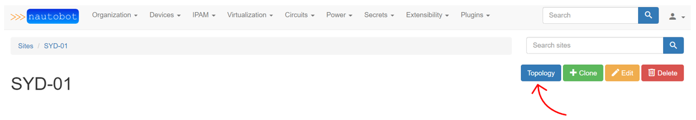
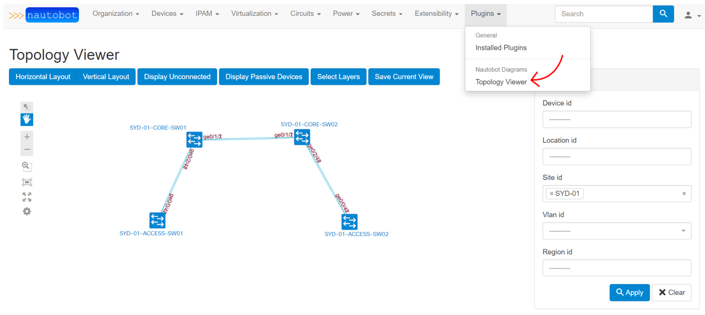

# Nautobot Diagrams Plugin

## Content

1. About
1. Usage
1. Requirements and Pre-requisites
1. Installation
1. Known Issues
1. Contribute


## 1. About 
Nautobot Diagrams Plugin is a plugin for [Nautobot](https://github.com/nautobot/nautobot) to generate netwpork diagrams automatically for Sites and Regions. It has been built by porting [NextBox UI Plugin](https://pypi.org/project/nextbox-ui-plugin/) - a topology visualization plugin for [NetBox](https://github.com/netbox-community/netbox) powered by [NextUI](https://developer.cisco.com/site/neXt/) Toolkit.


## 2. Usage
Once installed and initialized, this plugin runs on a backend and can be accessed in the following ways:
1. By using `Topology` button on a `Site` page.
    


1. By navigating to `Topology Viewer` page via `Plugins -> Nautobot Diagrams -> Topology Viewer`
    


## 3. Requirements and Pre-requisites
Nautobot Diagrams Plugin requires Nautobot v1.2.8.


## 4. Installation

### Installing with Poetry

#### Clone the Plugin Repo
To clone the plugin repo into the server:
1. Create/Navigate to a directory where the source code of this plugin is to be cloned into.
1. Clone the plugin into that directory.

#### Installing the Plugin
1. Activate the virtual environment for Nautobot usiing `poetry shell` command.
1. Navigate to the plugin directory where the `pyproject.toml` file is located.
1. Run `poetry install` from that directory.
1. Run `pip list installed | grep nautobot-diagrams` to verify if you have the plugin and the correct/latest version is installed

### Enabling the Plugin
1. Once you confirmed that the plugin has successfully been installed, add it to the plugin section of Nautobot configuration file:
    ```python
    PLUGINS = ['nautobot_diagrams']
    ```

2. Verify that the plugin is installed successfully by navigating to `Plugins -> Installed Plugins`. You should see the newly installed plugin in the list of installed plugins.


### Run Database Migrations Of the Plugin
1. Check the current migrations for Nautobot Diagrams Plugin using the following command:
    ```bash
    (nautobot-venv) $ nautobot-server showmigrations nautobot_diagrams
    ```

1. Create a migration file for Nautobot Diagrams Plugin if it does not exist using the following command:
    ```bash
    (nautobot-venv) $ nautobot-server makemigrations nautobot_diagrams
    ```

1. Apply all unapplied migrations for Nautobot Diagrams Plugin using the following command:
    ```bash
    (nautobot-venv) $ nautobot-server migrate nautobot_diagrams
    ```

1. Verify the migration has been successfull for Nautobot Diagrams Plugin using the following command:
    ```bash
    (nautobot-venv) $ nautobot-server showmigrations nautobot_diagrams
    ```
You should see the `[X]` symbol in fornt of the migration file name, which means the migration has successfully been applied.


### Collect Static Files Of the Plugin
This plugin has its own static files and needs to be collected from the plugin's static directory into Nautobot's static root directory.
1. Assuming the Virtual environment is activated for Nautobot, navigate to Nauthobot directory:
    ```bash
    (nautobot-venv) $ cd /path/to/nautobot/dir
    (nautobot-venv) $ nautobot-server collectstatic
    ```


### Restart Nautobot
Restart the Nautobot for the changes to take effect.


## Known Issues
1. Zoom buttons (+/-) in the UI don't work. Mouse scrolling works instead.
2. "Save a tpology" button doesn't work yet. It seems it is something to do with Jquery (my weakest side and needs some reaserch).
3. A slight delay (2-3 secs) before the button become active Site Topology.


## Contribute
Anyone is welcome to contribute to this repo.

The repo has 2 branches at the moment.
* <span style="color:orange">dev</span> - used for the latest development code
* <span style="color:green">main</span> - used for the latest stable code
